# SQL Injection en Python – Proyecto de Ciberseguridad

Este proyecto forma parte de mi portfolio de prácticas de ciberseguridad ofensiva y defensiva.  
Aquí simulo un ataque de tipo **SQL Injection** usando Python y SQLite, y luego muestro cómo **corregirlo** para proteger la aplicación.

---

## ¿Qué aprendí?

- Qué es una SQL Injection y por qué es peligrosa.
- Cómo se ejecuta una inyección en un programa vulnerable.
- Cómo evitarla utilizando consultas preparadas (`prepared statements`).
- Cómo manejar entradas del usuario de forma segura en Python.

---

## Herramientas usadas

- **Python** (lenguaje de programación)
- **SQLite3** (base de datos local)
- **Visual Studio Code** (editor)
- Terminal / CMD

---

## Estructura del proyecto
sql-injection/ 
# Capturas de pantalla con todo el proceso para verlo de manera visual
  ├── images
# Crea la base de datos y agrega usuarios
  ├── crear_db.py  
# Versión con vulnerabilidad SQLi
  ├── vulnerable.py 
# Versión protegida 
  ├── seguro.py 
# Verifica qué hay en la base de datos 
  ├── ver_usuarios.py 
# Este archivo con la explicación detallada
    └── README.md  
# Crear aplicación con Flask para probar los fallos y las soluciones
  ├── app.py
 
---

## Base de datos

Creamos una tabla llamada `users` con los siguientes usuarios:

| id | nombre  |
|----|---------|
| 1  | Juan    |
| 2  | Alicia  |
| 3  | Lola    |
| 4  | Luis    |
| 5  | Marina  |


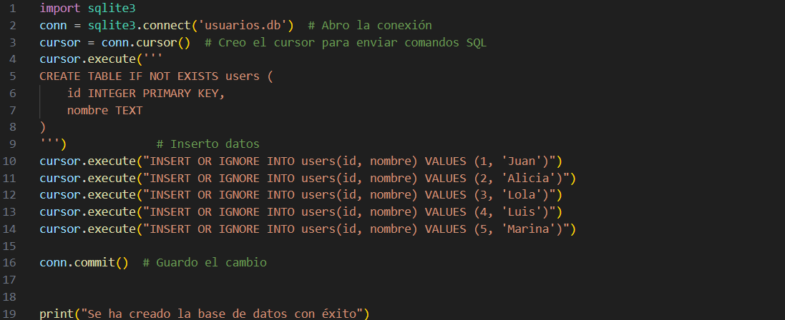
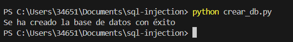
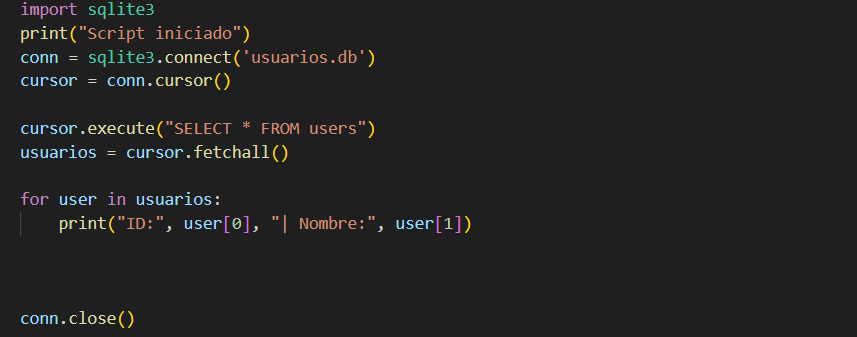
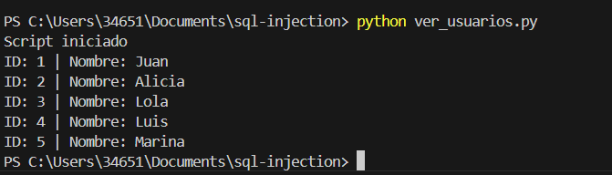

---

## Versión vulnerable y Versión segura (`vulnerable.py` `seguro.py`)

Este código **no protege la entrada del usuario**:

user_input = input("Introduce el ID del usuario: ")
query = f"SELECT * FROM users WHERE id = {user_input};"
cursor.execute(query)

El atacante introduce 1 OR 1=1 y la consulta queda de la siguiente manera; 
SELECT * FROM users WHERE id = 1 OR 1=1; # Se devuelven todos los usuarios y no solo 1, por tanto ataque exitoso.

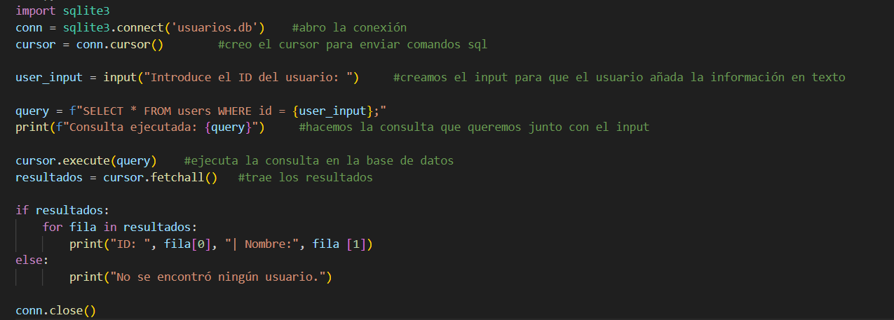

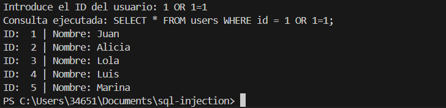

## Protegemos la aplicación usando una consulta preparada:

query = "SELECT * FROM users WHERE id = ?"
cursor.execute(query, (user_input,))

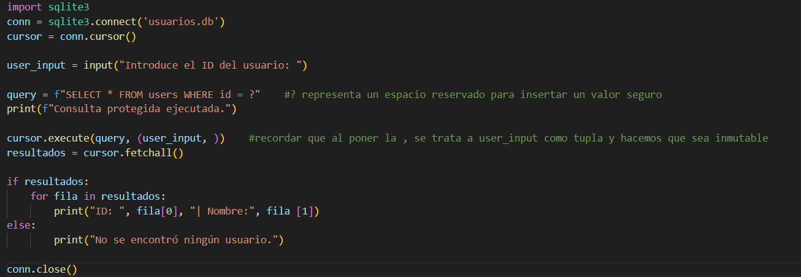


## ¿Por qué funciona?
El ? es un espacio reservado: dice “aquí va un dato, no código”.

(user_input,) es una tupla con un solo valor. Python necesita la coma para que lo interprete correctamente. Así evitamos que el input malicioso se ejecute.

## Resultado:
Input: 1 OR 1=1 → ❌ ya no devuelve nada
Input: 1 → ✅ solo devuelve el usuario con ID 1

## Explicación técnica extra
¿Por qué usamos (user_input,) y no solo user_input? 
(5)     # Esto es un número (int)
(5,)    # Esto es una tupla con un solo valor
Si no usamos la coma, .execute() no sabe cómo reemplazar el ? correctamente.
Por eso se usa siempre una tupla, incluso si tiene solo un valor.

## Cómo ejecutar el proyecto
Clona el repositorio o copia los archivos.

## Ejecuta primero:
python crear_db.py
## Luego prueba:
python vulnerable.py     # Para ver el fallo
python seguro.py         # Para ver la solución

---

## Extensión Web – App en Flask
Como parte de la ampliación del proyecto, creé una mini aplicación web usando **Flask**, que simula la vulnerabilidad y la solución desde una interfaz web.

La app tiene dos rutas:

| Ruta | Descripción |
|------|-------------|
| `/vulnerable` | Consulta de usuarios con entrada directa y vulnerable a SQL Injection |
| `/seguro`     | Consulta protegida usando parámetros seguros (`prepared statements`) |

---

### Cómo ejecutarla

1. Asegúrate de tener Flask instalado:
   
   ```bash
   pip install flask

2. Ejecuta el script:

python app.py

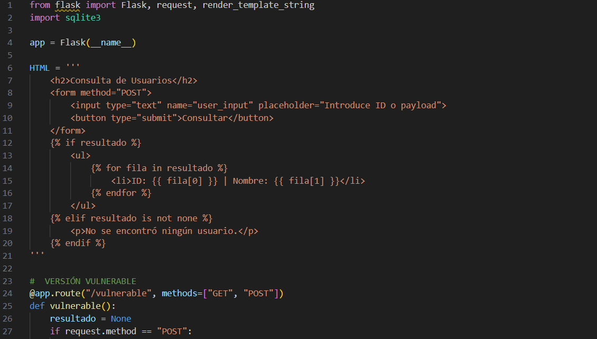
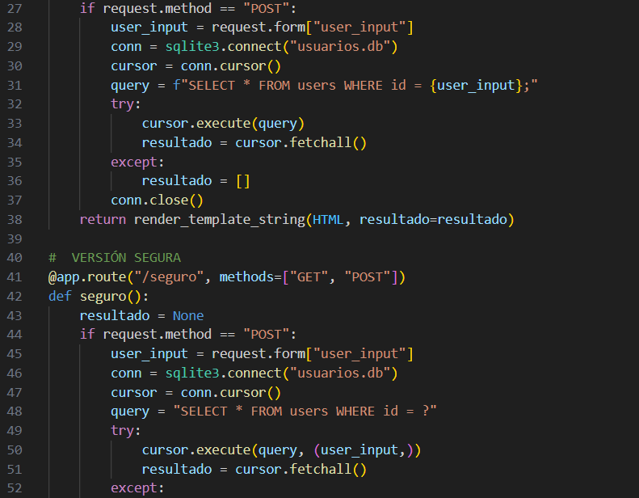
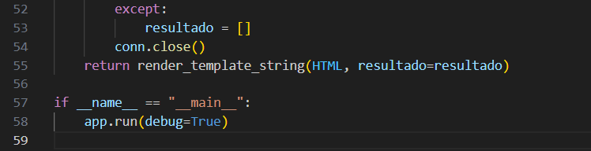

3. Abre tu navegador en:

🧨 http://127.0.0.1:5000/vulnerable     # 1 OR 1=1  añade y comprueba que muestra toda la base de datos


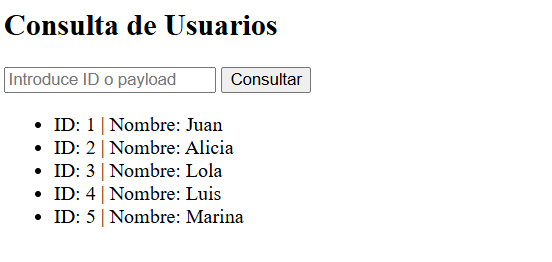

🛡️ http://127.0.0.1:5000/seguro    # 1 OR 1=1 añade y comprueba que aparece el mensaje "No se encontró ningún usuario."                                             Inyección bloqueada correctamente.


## Autora de este proyecto: 
María Victoria Romero – Estudiante de ciberseguridad
Me puedes encontrar en GitHub como https://github.com/Mariaromeroruiz    
@mariaromeroruiz

